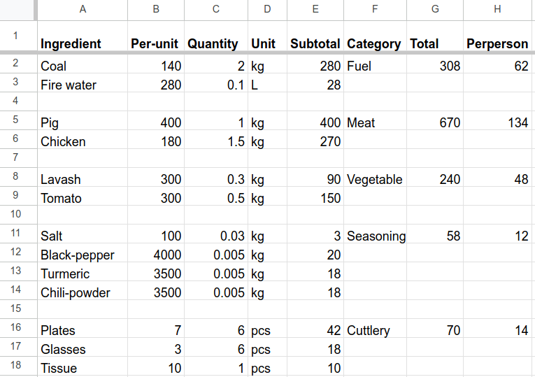
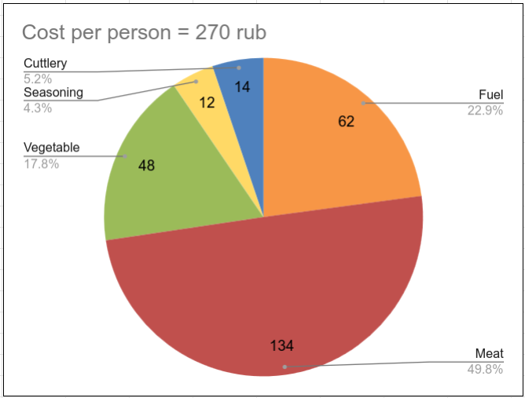
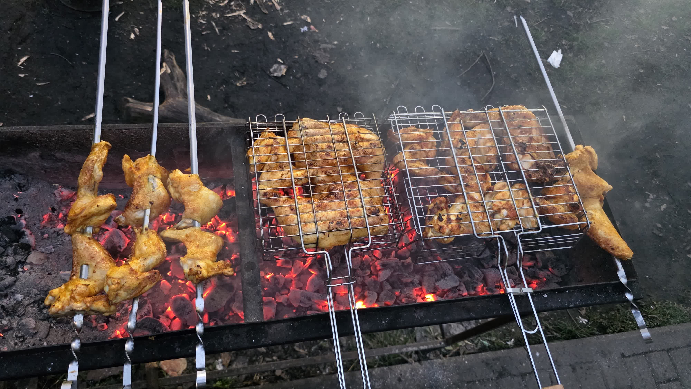

# Sashlik

## Estimates
1. 1 person requires 0.5kg meat.
1. 1kg  meat requires 12g salt.
1. 1kg meat requires 5g seasonings.
1. 3kg meat can be grilled with two mesh and 4 skewers.
1. Two mesh and 1 skewer occupies 0.5 part of the iron case.
1. 0.5 part of the iron case requires 1 kg of coal.
1. Coal from pyateorochka burns for 1 hour.

## Required products and prices

## Inventory check before leaving house
### Fire equipments
1. Coal
1. Fire water
1. Lighter
1. Match sticks
1. Fan
1. Spade
1. Paper as kindle wood

### Handy equipments
1. Small bottle of water
1. Knife
1. Hand towel
1. Wet wipes
1. Tissue papers

### Food
1. Meat boxes
1. Tomato box
1. Bread
1. Drinks

### Meat processing equipments
1. Skewers
1. Cutting board

### Eating equipments:
1. Packet for the table
1. Plates
1. Glasses

## Breakdown of cost 

## What to do:
1. Cut tomato, extract juice.
1. Use juice as marination fluid.
1. Marinate 15 - 20 hours.
1. Perform equipment check.
1. Search for a wood to stir the coal.
1. Scoop out the old ashes.
1. Pour only half of a 2.5kg packet in a small spot, unless there are more skewers.
1. Put the papers in the middle of coal. Save papers for the next round.
1. Wet single paper with fire water.
1. Light the paper in hand.
1. Put the burning single paper into the group of paper in coal.
1. Alert everyone to move away.
1. Pour fire water on the coal.
1. Fan until the coal is on fire.
1. Spread it out.
1. Put the meat.
1. Do not fan until at the end.
1. Do not eat immediately, let the meat cook itself in the box.

## Chicken on coal

1
